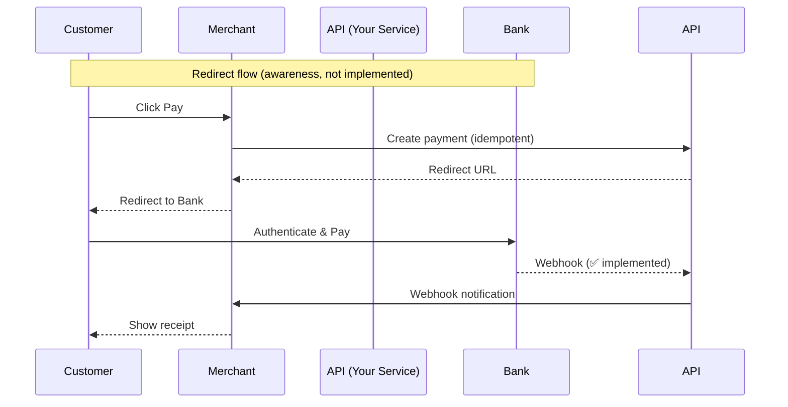

# 💳 Laravel Payment Gateway (OPP‑style)

A production‑aware payment gateway implementing **idempotency**, **escrow**, **webhook confirmation**, and **split payments**. Built with Laravel, MySQL, Redis, and DDD principles. **CI/CD via GitHub Actions** automatically runs the full test suite on every push, ensuring code reliability.


## Payment Flow (Implemented)

1. **Client creates payment** → Status: `pending` (idempotency key enforced)  
2. **Bank webhook confirms** → Status: `held`, escrow record created  
3. **Auto‑release after 5 days** → Status: `completed`  
4. **Dispute handling** → Status: `disputed` → `refunded`

---

## Why Webhook‑Only? (Production Awareness)

In a live environment, customers would be redirected to their bank to authenticate.  
This project focuses on the **webhook pattern** because it is the most reliable way to guarantee payment status updates (even if the browser closes).  

The redirect flow would add authentication but does **not** change the core escrow and idempotency logic.  

---

## Payment Flow Diagram




## Idempotency Key – Merchant Responsibility

To prevent double charges and duplicate payments, **the merchant (store) is responsible for generating and storing the idempotency key**.

### How It Works

1. **Merchant generates a unique key** (e.g., UUID v4) when the user clicks checkout.
2. **Merchant stores the key** in their own database (e.g., `orders.idempotency_key`) for that transaction.
3. **Merchant sends the key** in the `Idempotency-Key` header when calling `POST /api/payments`.
4. **OPP platform**:
   - On first request: processes payment, stores response (including redirect URL), and returns it.
   - On duplicate request (same key): returns the cached response without processing again.
5. **Merchant redirects the user** to the returned `redirect_url` to complete payment.

### Example (Merchant Side – Pseudocode)

```php
// Generate and store key
$idempotencyKey = (string) \Illuminate\Support\Str::uuid();
$order->idempotency_key = $idempotencyKey;
$order->save();

// Call OPP API
$response = Http::withHeaders([
    'Idempotency-Key' => $idempotencyKey,
])->post('https://api.opp.com/api/v1/payment', [
    'amount' => $order->total,
    'currency' => 'EUR',
    'merchant_id' => 'ikea',
    'customer_email' => $order->customer_email,
]);

// Redirect user to payment gateway
return redirect($response->json('redirect_url'));
```

## Key Technical Decisions

| Concept | Implementation |
|---------|----------------|
| **Idempotency** | Redis + database unique keys prevent double charging |
| **Escrow** | Separate `escrow_holds` table tracks held, released, refunded, and disputed timestamps |
| **Webhook** | Bank confirmation triggers status changes, resilient to client disconnects |
| **Split payments** | Supports seller + platform amounts (e.g., 95% / 5%) |
| **Domain‑Driven Design** | Clear separation of Payment, Escrow, Split, and Dispute contexts |
| **Testing** | Feature tests cover idempotency, webhook, and escrow transitions |
| **CI/CD** | GitHub Actions automatically runs tests on every push and pull request |

## Live Demo

Run the project with Laravel Sail, then:
> Run **docker** and in the root of the porject run **sail up -d**

```bash
# Create a payment
curl -X POST http://localhost/api/v1/payment \
  -H "Idempotency-Key: test-001" \
  -H "Content-Type: application/json" \
  -d '{
    "amount": 99.99,
    "currency": "EUR",
    "merchant_id": "ikea",
    "customer_email": "maria@example.com"
  }'

# Simulate success bank webhook (replace TXN_... with actual transaction_id)
curl -X POST http://localhost/api/v1/payment/bank-webhook \
  -H "Content-Type: application/json" \
  -d '{
    "transaction_id": "TXN_ABC123",
    "status": "success"
    "amount": 99.99,
    "bank_refrence": "34236786786"
  }'

# Simulate failed bank webhook (replace TXN_... with actual transaction_id)
curl -X POST http://localhost/api/v1/payment/bank-webhook \
  -H "Content-Type: application/json" \
  -d '{
    "transaction_id": "TXN_ABC123",
    "status": "failed"
    "amount": 99.99,
    "bank_refrence": "34236786786"
  }'

```

## Escrow Auto‑Release Process

After a payment is successfully confirmed and held in escrow, the funds are **automatically released** to the seller after a predefined waiting period (default: **5 days**).

### Why auto‑release?

- Protects sellers from indefinite holds when buyers do not confirm delivery.
- Reduces manual intervention and speeds up settlement.
- Provides a predictable timeline for both parties.

### How it works

1. When a payment status changes to `held`, an `auto_release_at` timestamp is set to **5 days in the future**.
2. A background job (cron) runs the command frequently:

```bash
# Run with default batch size (50)
php artisan escrow:release-expired

# Run with custom batch size (e.g., 200)
php artisan escrow:release-expired --batch-size=200
```